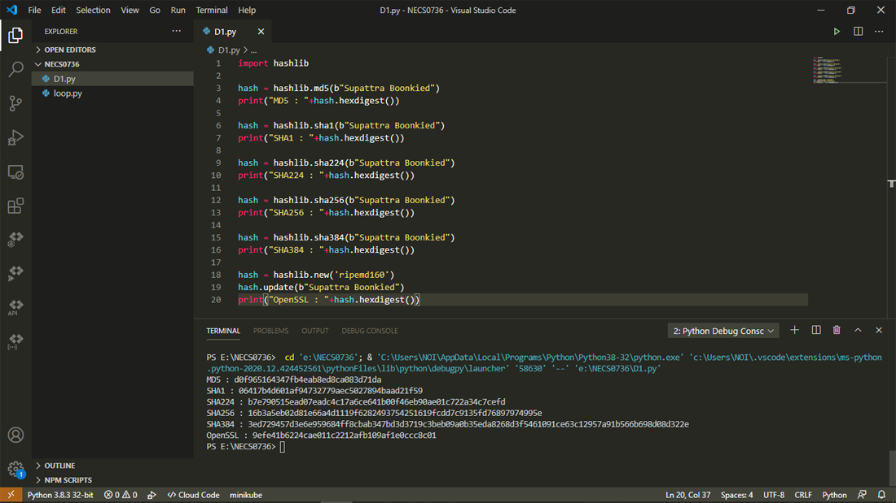

## Hash ข้อความด้วย Python  
 
Hash เป็นการนำข้อมูลต้นฉบับ มาผ่านกระบวนการทางคณิตศาสตร์ โดยค่า Hash ที่ได้นั้น เราไม่สามารถทำย้อนกลับไปเป็นต้นฉบับได้
ถ้าข้อมูลต้นฉบับมีการเปลี่ยนแปลงเพียงเล็กน้อยจะทำให้ค่า Hash แตกต่างจากเดิมอย่างสิ้นเชิง
ขนาดข้อมูลต้นฉบับมีจำนวนเท่าใดค่าของ Hash มีจำนวนบิตคงที่เสมอ และค่า Hash ต้องไม่มีการซ้ำกันหรือซ้ำกันน้อยมาก
ในการ Hash ข้อความด้วย Python เราต้องใช้โมดูลที่มีชื่อว่า hashlib  สามารถ Hash ด้วย Algorithm ได้ดังนี้ครับ
 
  - md5  
  - sha1  
  - sha224  
  - sha256  
  - sha384  
  - OpenSSL Algorithms  
 

   Python Hash ข้อความด้วย MD5  
   
     โค้ดตัวอย่าง     
        import hashlib 
        hash = hashlib.md5(b"Supattra Boonkied")  
        print("MD5 : "+hash.hexdigest())  
    
     ผลลัพธ์
        MD5 : d0f965164347fb4eab8ed8ca083d71da

   Python Hash ข้อความด้วย SHA1  
   
     โค้ดตัวอย่าง     
        import hashlib 
        hash = hashlib.sha1(b"Supattra Boonkied") 
        print("SHA1 : "+hash.hexdigest())  
    
     ผลลัพธ์
        SHA1 : 06417b4d601af94732779aec5027894baad21f59
      
   Python Hash ข้อความด้วย SHA224  
   
     โค้ดตัวอย่าง     
        import hashlib 
        hash = hashlib.sha224(b"Supattra Boonkied") 
        print("SHA224 : "+hash.hexdigest())  

     ผลลัพธ์
        SHA224 : b7e790515ead07eadc4c17a6ce641b00f46eb90ae01c722a34c7cefd
  
   Python Hash ข้อความด้วย SHA256  
   
     โค้ดตัวอย่าง     
        import hashlib 
        hash = hashlib.sha256(b"Supattra Boonkied") 
        print("SHA256 : "+hash.hexdigest())  

     ผลลัพธ์
        SHA256 : 16b3a5eb02d81e66a4d1119f6282493754251619fcdd7c9135fd76897974995e
        
   Python Hash ข้อความด้วย SHA384  
   
     โค้ดตัวอย่าง     
        import hashlib 
        hash = hashlib.sha384(b"Supattra Boonkied") 
        print("SHA384 : "+hash.hexdigest())  

      ผลลัพธ์
        SHA384 : 3ed729457d3e6e959684ff8cbab347bd3d3719c3beb09a0b35eda8268d3f5461091ce63c12957a91b566b698d08d322e
          
   Python Hash ข้อความด้วย OpenSSL Algorithms  
   เราสามารถ Hash ข้อความด้วย OpenSSL Algorithms ได้โดยมีตัวอย่างการเข้า  Hash ข้อความด้วย OpenSSL Algorithms ดังนี้  
   
     โค้ดตัวอย่าง     
        import hashlib 
        hash.update(b"Supattra Boonkied")  
        print("OpenSSL : "+hash.hexdigest())  

      ผลลัพธ์
        OpenSSL : 9efe41b6224cae011c2212afb109af1e0ccc8c01
        
ทดสอบรันด้วยโปรแกรม Visual Studio Code  
 
  

