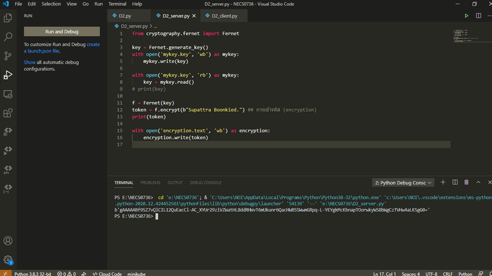
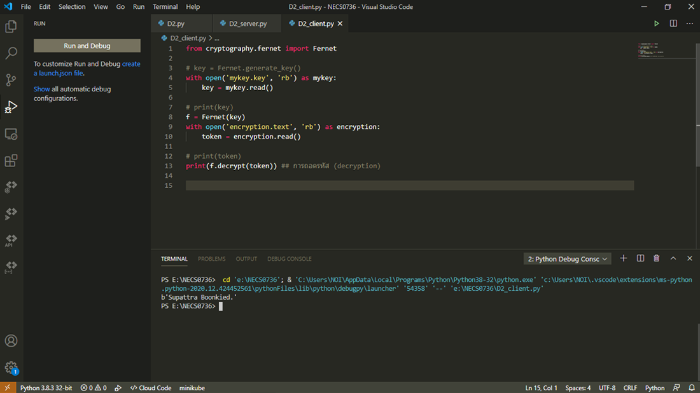

## Cryptography การเข้ารหัสข้อมูลด้วย Python  

ประเภทของการเข้ารหัสข้อมูล  
  - Secret Key หรือ Symmetric Key Cryptography  
  - Public Key หรือ Asymmetric Key Cryptography  
  
การเข้ารหัสข้อมูลมีกระบวนการที่เกี่ยวข้อง 2 ขั้นตอน คือการเข้ารหัส (encryption) และการถอดรหัส (decryption) แต่มีบางฟังก์ชันที่เข้ารหัสแบบทางเดียว (เข้ารหัสไปแล้วจะไม่นำมาถอดรหัสอีก) เรียกว่า Hash function ผลที่ได้จะเป็น ciphertext ที่มีความยาวคงที่และจะไม่ถอดรหัสกลับมาเป็น plaintext อีก มีประโยชน์ในการใช้ตรวจสอบความถูกต้องของข้อมูล (Integrity) ว่าข้อมูลนั้นจะไม่ถูกแก้ไขหรือเปลี่ยนแปลงระหว่างทาง  

### Secret Key or Symmetric Key Cryptography  
Secret Key หรือเรียกว่าการเข้ารหัสแบบสมมาตร (Symmetric Key) หัวใจคือใช้คีย์ (Key) เดียวกันสำหรับการเข้าและถอดรหัส โดยที่ความยาวของคีย์นั้นคงที่เสมอ  

### Public Key or Asymmetric Key Cryptography  
เมื่อต้องการส่ง Symmetric Key ผ่านระบบเครือข่ายเพื่อให้เกิดความปลอดภัยมากที่สุด เราจะหุ้ม Symmetric Key นี้อีกชั้น
เป้าหมายคือจะสร้างคีย์ใหม่ขึ้นมา 2 คีย์ ด้วยวิธีการที่ว่า  
  - จะสร้าง private key ขึ้นมาก่อน  
  - จากนั้นนำ private key มาสร้าง public key ทั้งสองนี้จะมีความสัมพันธ์ทางคณิตศาสตร์แบบคีย์คู่ซึ่งเข้าใจเฉพาะคู่ของมันเท่านั้น  

เมื่อเราใช้คีย์หนึ่งเข้ารหัสข้อมูล (จะใช้ private key หรือ public key ก็ได้) อีกคีย์หนึ่งจะใช้ถอดรหัสข้อมูลเสมอ ตัวอย่าง  
  - ใช้ private key เข้ารหัส ก็ต้องใช้ public key ถอดรหัส  
  - ใช้ public key เข้ารหัส ก็ต้องใช้ private key ถอดรหัส  
  
ติดตั้งโมดูล cryptography ได้โดยใช้ pip ด้วยคำสั่ง  
pip install cryptography  

### การเข้ารหัส Encryption  
ทดสอบรันด้วยโปรแกรม Visual Studio Code  
 
  
 
### การถอดรหัส Decryption         
ทดสอบรันด้วยโปรแกรม Visual Studio Code  
 
  
