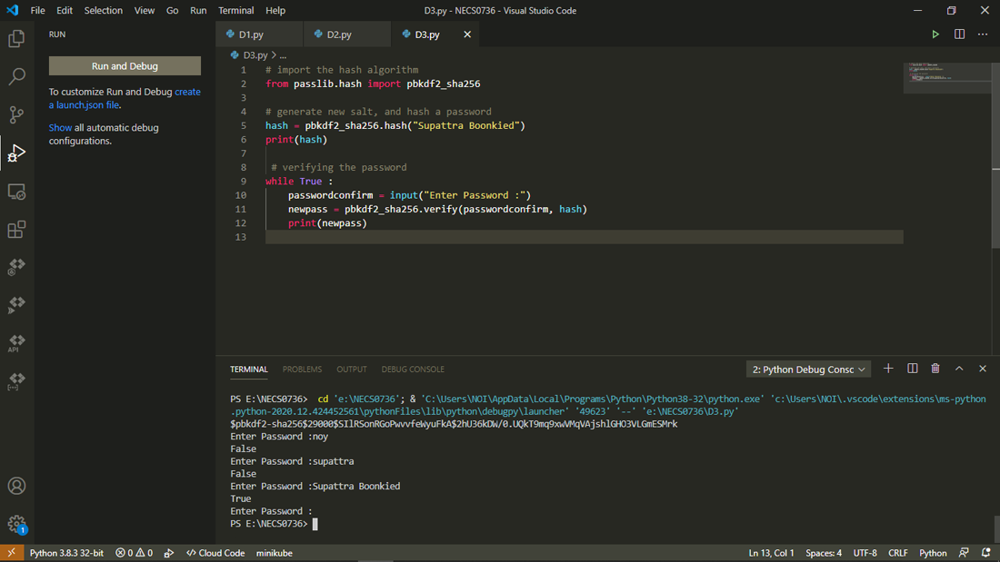

## passlib.hash ตรวจสอบ password ด้วย python  

การใช้งาน module passlib.hash ของภาษา python  
passlib.hash คือ module ในภาษา Python ซึ่งสามารถนำมาประยุกต์ไว้ใช้เช็คค่าของ password ยืนยันได้ สำหรับคนที่กำลังหาวิธีการในการตรวจสอบ password ผลลัพธ์ของ module 
จะออกมาเป็น ค่า boolean ซึ่งมี ค่า true กับ ค่า false   

ติดตั้งโมดูล passlib ได้โดยใช้ pip ด้วยคำสั่ง  
pip install passlib  

กำหนดรหัสผ่านขึ้นมาแล้วแปลงค่าเก็บไว้ในตัวแปร hash  

    ตัวอย่างโค้ด     
        from passlib.hash import pbkdf2_sha256
        hash = pbkdf2_sha256.hash("Supattra Boonkied")
        print(hash)
  
    ผลลัพธ์
        $pbkdf2-sha256$29000$SIlRSonRGoPwvvfeWyuFkA$2hU36kDW/0.UQkT9mq9xwVMqVAjshlGHO3VLGmESMrk
   
นำ password ที่จะตรวจสอบมาตรวจความถูกต้องค่าของการตรวจสอบก็จะได้มาเป็น boolean

    ตัวอย่างโค้ด     
        from passlib.hash import pbkdf2_sha256
        hash = pbkdf2_sha256.hash("Supattra Boonkied")       
        while True :
            passwordconfirm = input("Enter Password :")
            newpass = pbkdf2_sha256.verify(passwordconfirm, hash)
            print(newpass)
  
    ผลลัพธ์
        Enter Password :noy
        False
        Enter Password :Supattra Boonkied
        True
        
ทดสอบรันด้วยโปรแกรม Visual Studio Code  
 
  
