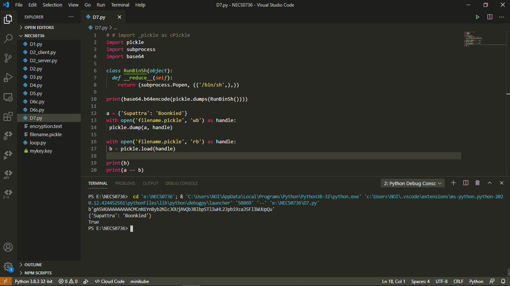

## Pickle เก็บข้อมูลและอ่านข้อมูลด้วย python 

pickle เป็นโพรโทคอไบนารี (binary protocols) สำหรับ serializing (แปลงวัตถุให้กลายเป็นสายข้อมูลในรูปแบบบิต) และ de-serializing (แปลงย้อนกลับมาเป็นวัตถุ) ของโครงสร้างวัตถุ Python
pickle มีปัญหาที่ทำงานได้ช้ากว่า json และมีปัญหาเรื่องความปลอดภัย ไม่ควรนำไปรันใช้งานจริง แนะนำให้ใช้ json แทน

ความแตกต่างไลบรารี pickle ระหว่าง Python 2 กับ Python 3  
ใน Python 2 มีการ import เหมือนกัน แต่ได้มีโมดูลหนึ่งขึ้นมาคือ cPickle ซึ่งเป็นโมดูล Pickle ที่ถูกเขียนด้วยภาษา C มีการเรียกใช้งานคล้าย ๆ กัน แต่ใน Python 3 โมดูลนี้ได้ถูกรวมเข้ากับโมดูล Pickle แล้ว ยกเว้น Python 2

ติดตั้งโมดูล Pickle ได้โดยใช้ pip ด้วยคำสั่ง  
pip install pickle-mixin  

ทดสอบรันด้วยโปรแกรม Visual Studio Code  
 
  
 
