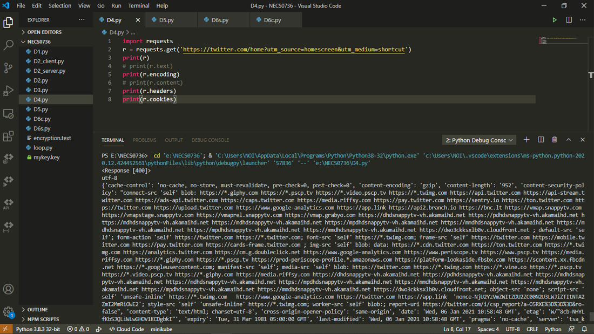

## Requests.get อ่านหน้าเว็บด้วย Python   

Requests คืออะไร?  
Requests คือ HTTP Library ตัวหนึ่งที่เขียนด้วยภาษา Python ให้เราส่ง HTTP/1.1 request ไป
requests สามารถใช้งานได้กว้างขวางและง่ายกว่า urllib จึงแนะนำให้ใช้มากกว่า  

การอ่านหน้าเว็บทำโดยใช้คำสั่ง get  
คำสั่ง get จะทำการอ่านเว็บแล้วคืนผลที่ได้ออกมาเป็นออบเจ็กต์ชนิด Response ซึ่งเก็บข้อมูลต่างๆของหน้าเว็บนั้นไว้  
    
    ตัวอย่างโค้ด
      import requests
      r = requests.get('https://twitter.com/home?utm_source=homescreen&utm_medium=shortcut')
      print(r) 
    ผลลัพธ์
      <Response [400]>

สามารถดูได้ว่าเว็บนี้มีการใช้รหัสอักษรแบบไหนโดยดูที่ .encoding  
    
    ตัวอย่างโค้ด
      import requests
      r = requests.get('https://twitter.com/home?utm_source=homescreen&utm_medium=shortcut')
      print(r.encoding) 
      
    ผลลัพธ์
      utf-8
      
r ที่ get ได้ออกมานอกจากเก็บเนื้อหาของเว็บเป็น html ไว้ที่ text แล้วก็ยังเก็บข้อมูลสำคัญอื่นๆเช่น header หรือ cookies ไว้ด้วยสามารถดูได้  

    print(r.headers)
    print(r.cookies)
    
ติดตั้งโมดูล Requests ได้โดยใช้ pip ด้วยคำสั่ง  
pip install Requests  

ทดสอบรันด้วยโปรแกรม Visual Studio Code  
 
  
