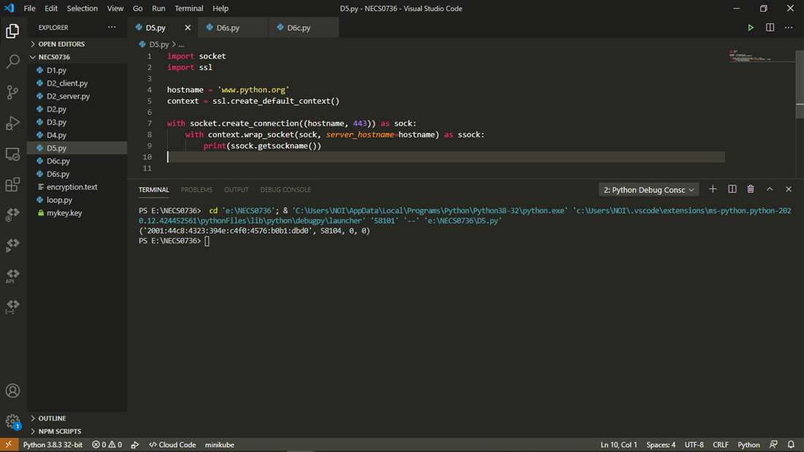

## SSL เพิ่มความปลอดภัยด้วย Python  
SSL ย่อมาจาก Secure Socket Layer  
ซึ่งปัจจุบันได้พัฒนาขึ้นมาเป็น TLS (Transport Layer Security) คือ เทคโนโลยีการเข้ารหัสข้อมูล เพื่อเพิ่มความปลอดภัยในการสื่อสารหรือส่งข้อมูลบนเครือข่ายอินเทอร์เน็ต ระหว่างเครื่องเซิร์ฟเวอร์กับเว็บเบราว์เซอร์หรือ Application ที่ใช้งาน เพื่อให้ข้อมูลของท่านปลอดภัยจากการเข้าถึงข้อมูลจากแฮกเกอร์ โดยวิธีการเรียกใช้งาน จะเรียกผ่านโปรโตคอล HTTPS หรือโปรโตคอลความปลอดภัยอื่นๆ ตามแต่วิธีการใช้งาน  

ติดตั้งโมดูล cryptography ได้โดยใช้ pip ด้วยคำสั่ง  
pip install cryptography  

ทดสอบรันด้วยโปรแกรม Visual Studio Code  
 
  
