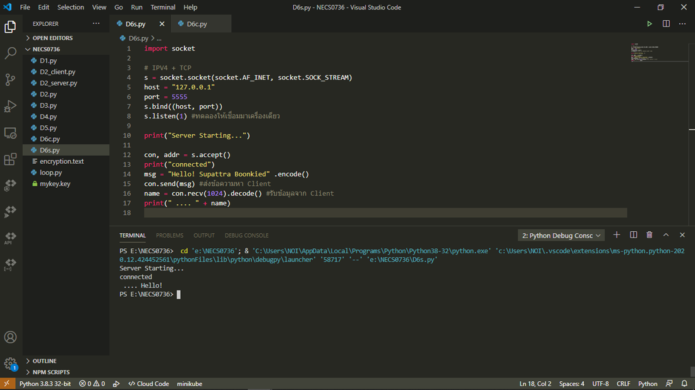
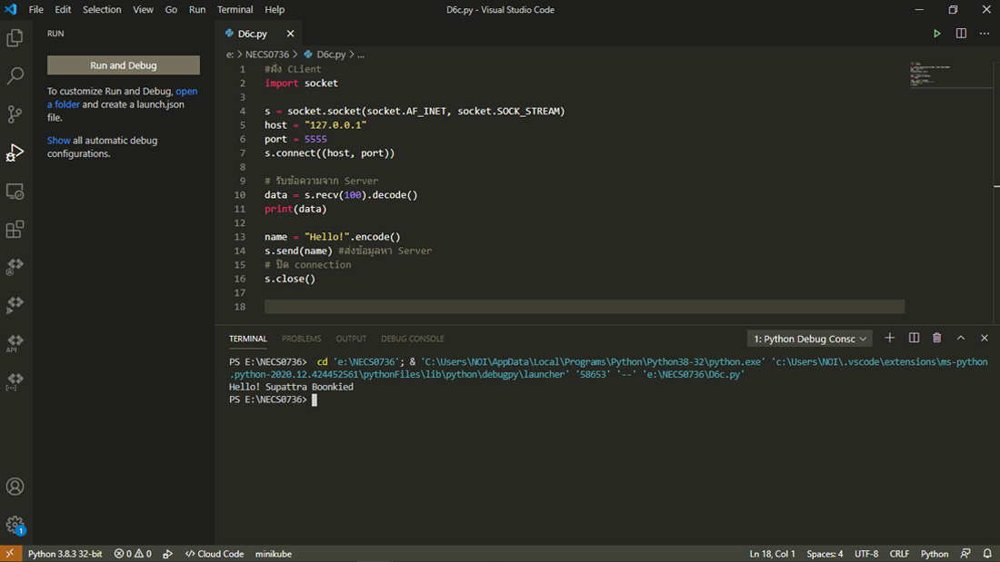

## Socket การส่งข้อมูลหากันระหว่าง client กับ server ด้วย Python  

Socket Programming  
เป็นการเขียนโปรแกรมที่ใช้ Socket เป็นช่องทางที่ใช้สำหรับการรับส่งข้อมูลกันระหว่างเครื่องหรือโปรแกรม โดยอาจจะเป็นระหว่าง server กับ client ซึ่งการรับส่งข้อมูลสามารถทำได้ทั้งสองทางและเก็บสถานะการติดต่อแต่ละครั้งเอาไว้ได้ ในขณะที่ถ้าเป็นการรับส่งข้อมูลแบบ REST จะไม่จำสถานะการติดต่อของแต่ละครั้ง และการติดต่อต้องเริ่มจากฝั่งใดฝั่งหนึ่งเท่านั้น  

ในการใช้งาน Socket นั้นจะต้องมีฝั่งหนึ่งที่ทำการเริ่มสร้างช่องทางการเชื่อมต่อขึ้นมา แล้วให้อีกฝั่งหนึ่งเข้ามาเชื่อมต่อ ซึ่งส่วนใหญ่ server จะเป็นฝั่งที่สร้างเอาไว้และให้ client เข้ามาเชื่อมต่อ โดยจุดที่ต่างจาก REST ที่เป็นการ request จาก client ไปยัง server เพื่อส่งและรับข้อมูลเพียงอย่างเดียวก็คือ socket นั้นเมื่อเชื่อมต่อกันแล้ว server เองก็สามารถเริ่มการส่งข้อมูลติดต่อไปยัง client ได้ด้วย ไม่ต้องรอให้ client เป็นเริ่ม  

ติดตั้งโมดูล sockets ได้โดยใช้ pip ด้วยคำสั่ง  
pip install sockets  

### โปรแกรมฝั่ง server
ทดสอบรันด้วยโปรแกรม Visual Studio Code  
 
  
 
### โปรแกรมฝั่ง client
ทดสอบรันด้วยโปรแกรม Visual Studio Code  
 
  
 
